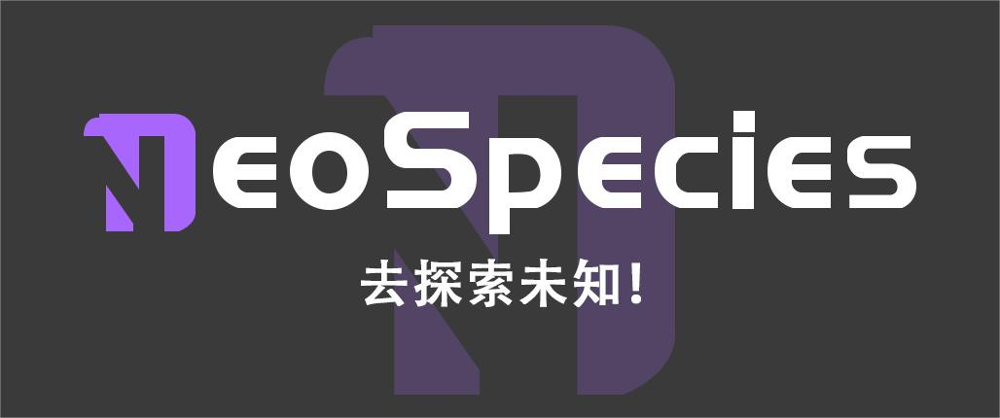

  

  <a href="https://www.linkedin.com/in/cogito/">LinkedIn</a>
  ·
  <a href="mailto:epochcentral@gmail.com">Email</a>
  ·
  <a href="https://www.neospecies.ai">Website/Portfolio</a>
  ·
  <a href="#🤝-lets-connect-collaborate">Collaborate</a> 

<h2> Hey there! I'm Cogito</h2>

<h3> 👨🏻‍💻 &nbsp;About Me </h3>

- 🤔 &nbsp; Blending diverse backgrounds in Biology, Technology, and Entrepreneurship to drive cross-domain innovation.
- 💼 &nbsp; 10+ years of experience in tech leadership and full-stack product delivery (from Hardware to Cloud).
- 💻 &nbsp; Specializing in AIoT, Large Language Model (LLM) Engineering, System Architecture, and cross-industry solutions.
- 🚀 &nbsp; As a Founder and CTO, successfully built multiple tech companies and delivered innovative, breakthrough products.
- 🎓 &nbsp; Actively contributing to the tech community, serving as a mentor in universities and sharing industry expertise.

<h3> 🛠 &nbsp;Tech Stack</h3>

- 💻 &nbsp; Programming Languages
    
    
    
    
    
    
    

- 🌐 &nbsp; Frontend & Mobile
    
    
    
    
    

- ⚙️ &nbsp; Backend & Frameworks
    
    
    
    

- 🛢 &nbsp; Databases
    
    

- ☁️ &nbsp; Cloud Native & DevOps
    
     
    
    

- 🧠 &nbsp; AI & Machine Learning
    
    

- 🔌 &nbsp; Hardware & IoT
    
    
    
    
    
    
    

- 🔧 &nbsp; Tools
    
    
    

 
<h3> 🛠 Commonly Used Tools & Systems:</h3>

  
  
  
  
  
  
  
  
  
  
  
  
  
  
  

 

# You can contact me through the following ways. 👋

<!-- **Vivekagent47/Vivekagent47** is a ✨ _special_ ✨ repository because its `README.md` (this file) appears on your GitHub profile. -->

# If you consider supporting me... 👋
|  |  |  |
| :--------------------------------: | :--------------------------------: | :------------------------------------: |
| PayPal打赏二维码                  | 支付宝打赏二维码                   | 微信打赏二维码                     |

### 🤝 Let's Connect & Collaborate:

- 💡 &nbsp; Exploring and driving **AIoT & LLM innovation in Smart Spaces** at Foresee AI. I'm particularly interested in collaborating on applications pushing the boundaries of AI and IoT integration in built environments.
- 🧠 &nbsp; Deep expertise in **Large Language Model (LLM) engineering** (fine-tuning, knowledge injection, alignment) and deploying **lightweight AI on edge devices**. Let's explore how to bring advanced intelligence closer to the data source.
- 🔌 &nbsp; Over a decade of experience in **full-stack AIoT delivery, from custom hardware (PCB design, MCUs, sensors) to cloud platforms**. Open to collaborations involving complex hardware-software co-design and integration challenges.
- 🚀 &nbsp; As a multi-company founder and CTO, I have extensive experience building and scaling tech ventures. I'm interested in advising or partnering on **deep tech startups** in AIoT, industrial AI, or related fields.
- 🤝 &nbsp; Actively contributing to open-source projects in lightweight AI. I'm looking to collaborate on **open-source initiatives** that have real-world industrial or environmental impact.
- 💬 &nbsp; Let's connect if you're working on **AIoT security, industrial automation, smart energy solutions, explosion-proof tech, or novel applications of AI in challenging environments**.

# focus on my data. 👋
 

</a>
